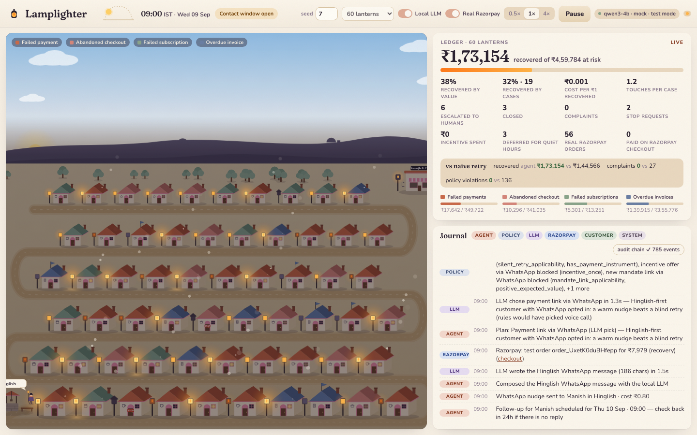
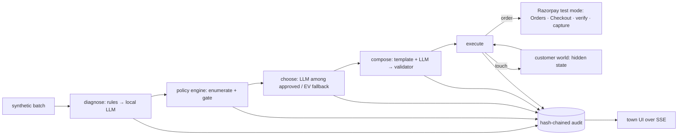

# Lamplighter

**A bounded AI revenue-recovery agent for Razorpay merchants, rendered as a cozy dusk-time town.**
Razorpay AI Buildathon 2026 · Track 3: AI Revenue Recovery

<p align="center"><a href="https://youtu.be/E3N7ZuVRwz4"></a></p>
<p align="center"><a href="https://youtu.be/E3N7ZuVRwz4"><b>▶ Watch the 5-minute pitch</b></a> · <a href="docs/ARCHITECTURE.md">Architecture</a> · <a href="docs/METRICS.md">Metrics</a> · <a href="docs/EVAL.md">Ten-seed evaluation</a> · <a href="docs/POLICY.md">The policy</a></p>

Saanjh & Co. is a small tea and candle studio in Jaipur that sells on Razorpay. Every week money slips away in undramatic ways:
a UPI collect times out, a card hits its daily limit, a bank is down for ten minutes, an AutoPay mandate gets paused, a café's wholesale invoice drifts past due.
Each customer is a **house**. Each at-risk payment is a **dark lantern**. Lamplighter is the agent that walks the streets and relights them — inside the rules.

## What it does

| the bar on the track page | how Lamplighter meets it |
|---|---|
| detect revenue at risk | four case kinds from one merchant: failed payments, abandoned checkouts, failed UPI AutoPay renewals, overdue B2B invoices — 50–120 synthetic records per run |
| determine the right intervention | rules + local LLM diagnosis of Razorpay error objects and raw bank/NPCI strings; a policy engine enumerates every action and gates it; the model chooses only among approved options |
| execute a bounded recovery workflow | silent retries, payment links per channel, Hinglish voice scripts, one-time incentives inside a budget, mandate re-auth, escalation with a packet, or close — each a real Razorpay test-mode Order + checkout page |
| measured money recovered across a batch | a seeded customer world with hidden state; the same world runs a naive-retry baseline; report shows ₹ recovered, cost per rupee, touches, complaints, STOPs, violations, by kind and by root cause |
| compliant escalation and stopping rules | quiet hours 21:00–09:00 IST, DND registry, three-touch cap, minimum gap, no repeats, no retry on hard declines, disputes to humans only, STOP ends everything, goodwill-aware expected value |
| audit trail | every decision, policy check, model call, Razorpay call and customer event in a hash-chained append-only log with a `/verify` endpoint |
| one failure handled gracefully | several, exercised with a `chaos` flag: model down or malformed, Razorpay 429/5xx, test-mode quotas, STOP arriving mid-flight |

## Numbers

120 synthetic cases, ₹10,74,826 at risk, one seeded customer world, 14 simulated days, local `qwen3-4b`, model on. Full report with by-kind and by-root-cause tables: [docs/METRICS.md](docs/METRICS.md).

| | Lamplighter agent | naive retry cron (same world) |
|---|---|---|
| recovered | **₹3,41,785 (31.8%)** | ₹1,36,148 (12.7%) |
| cases recovered | **59 / 120** | 19 / 120 |
| customer touches per case | **1.30** | 2.53 |
| complaints | **11** | 55 |
| policy violations | **0** | 358 |
| escalated to humans, with a reason | 11 | 3 |
| spend on channels + incentives | ₹2,530 | ₹76 |

Diagnosis accuracy against the generator's hidden ground truth: rules alone 71.7%, rules + local model on the raw bank strings **100%** (36 overrides, 36 correct). 407 model calls, 9 fell back to the deterministic path, 30 actions deferred for quiet hours.


**Across ten seeded worlds** (rules-only, same world for both arms, [docs/EVAL.md](docs/EVAL.md)): the agent recovers ₹2,58,832 more per 120-case batch than the cron on average (95% CI ₹1,56,604 to ₹3,61,061), wins 10 of 10 seeds on money and on complaints, with 1.61 touches per case instead of 2.50 and 0 policy violations instead of 352. Re-run with `pnpm eval`.

The baseline recovers ₹76 cheaper because it sends nothing but SMS; it also sends 358 messages it was not allowed to send. Invoices carry 81% of the value at risk and recover slowest (27.7% by value), mostly through promise-to-pay dates that fall inside the window only because it is 14 days long; that is why the report window is 14 days and the live town is 7.


## The town is not decoration

Judges and merchants both need to see *why* the agent did something. The town makes the state machine visible:

- **Lantern state = case status.** Dark (open), faint ember (waiting on purpose), amber flicker (message out), bright glow with a coin (recovered), blue flag (escalated to a human), hooded (closed by a stopping rule).
- **Day and night = the compliance rule.** At 21:00 IST the sky goes dark and the lamplighter sits down by the well. Deferred actions show up in the journal as `action_deferred … 09:00 IST`.
- **Click a house** to read the Razorpay error, the diagnosis with confidence and source, every candidate action with the rules it passed or failed, each message actually sent, the pay page, and the outcome.
- **The journal** is the audit log narrated in plain words, with actor chips (agent / policy / llm / razorpay / customer) and a chain-integrity badge.
- **The ledger** is the money: recovered vs at-risk, cost per recovered rupee, the naive-retry comparison, real Razorpay orders and real Checkout payments.
- **The week in review** (opens when the run ends, or from the ledger) turns the batch into analysis: cumulative recovery over time against the naive cron with quiet hours shaded, outcomes by kind and by root cause, agent-vs-cron small multiples, diagnosis accuracy and reliability.

<p align="center"></p>

## Where the AI is, and how it is kept honest

- **Diagnosis.** Rules map Razorpay's structured error (`code`, `reason`, `step`, description) to a root cause. When rules are unsure — a generic `payment_failed` with a raw string like `U30: DEBIT HAS BEEN FAILED (INSUFFICIENT BALANCE)` or `43: STOLEN CARD` — the local model classifies it under a strict JSON schema. It only overrides the rules when confident, disagreements are logged, and accuracy is measured against the generator's hidden ground truth in every report.
- **Choice.** The policy engine runs first and produces the approved list. When the top options are close in expected value, the model picks by index, is told what the numbers recommend, and must state a reason to deviate. When one option clearly dominates, the numbers win without a model call. Anything outside the list falls back to the highest expected-value candidate.
- **Copy.** Templates always work. The model drafts warmer copy (Hinglish in Roman script where the customer prefers it). A validator enforces the exact amount, merchant name, `{link}` placeholder, opt-out line, no threatening or urgency words, no Devanagari. Rejections are logged with the reason and the template goes out instead.
- **Money never moves on the model's say-so.** Recovery is recorded either by the simulator (labelled `simulated`) or by Razorpay after signature verification and capture (labelled `razorpay`).

The model is `qwen3-4b` running locally in LM Studio through the OpenAI-compatible API with `json_schema` structured output. No API spend, nothing leaves the machine, and `--llm off` is a first-class mode that the report compares against.

## What is real and what is simulated

- **Real:** Razorpay test-mode Orders for every outreach and every silent retry; the self-hosted Standard Checkout page; HMAC-SHA256 signature verification; capture of authorized payments; polling of order payments; the local model calls; the policy engine; the audit chain.
- **Simulated:** the customers. Each has a hidden archetype (temporary funds, forgot, friction, intent lost, hard no, disputer, busy accounts-payable), a salary day, an annoyance threshold, a chance of replying STOP. The agent never reads this. Notifications are not sent (synthetic contacts); the audit log says `delivery: simulated`.
- **Not counted:** payments that would land after the window (7 days in the live town, 14 days in the batch report because B2B promise-to-pay dates run a week or more out); cases still open at the end are closed as "window ended".
- **Known limit:** Razorpay test mode caps Payment Links at 30 per account, which is why links are Orders + a hosted page. In production the same page is the merchant's checkout, or a Payment Link.

## Run it

Prerequisites: Node 20+, pnpm, a Razorpay **test** key pair, and a local OpenAI-compatible model server (tested with LM Studio + `qwen/qwen3-4b`; Ollama works with any model that supports JSON schema output).

```bash
pnpm install
cp .env.example .env            # add RAZORPAY_KEY_ID / RAZORPAY_KEY_SECRET, LLM_BASE_URL, LLM_MODEL
lms server start && lms load qwen/qwen3-4b -y --identifier qwen3-4b   # or run Ollama
pnpm dev                        # server on :8787, town on :5173
```

If something else already owns port 8787, run `PORT=8801 API_PORT=8801 pnpm dev` instead. Open http://localhost:5173, press **Light the lamps**. Click any house. Open a pay page from the drawer and pay with a Razorpay test method (netbanking → Success, or card `4111 1111 1111 1111`); the lantern relights via `razorpay`.

Headless batch with report and baseline:

```bash
pnpm batch --seed 7 --size 120 --llm on --razorpay off --days 14 --baseline on --publish on   # writes docs/METRICS.md
pnpm batch --seed 7 --size 60 --llm on --razorpay on --chaos 0.2                     # watch retries and fallbacks in the audit log
pnpm test                                                                             # policy rules, audit chain, generator, Razorpay client
```

Outputs land in `data/runtime/<run>.json`, `.audit.jsonl` and `.report.md`. `?mock=1` runs the town fully offline; `?autostart=1` starts a run on load (used for the screenshots); `?run=<id>` re-attaches to a running batch.

## Architecture

See [docs/ARCHITECTURE.md](docs/ARCHITECTURE.md) for the loop, the guard table and the failure handling. The API contract the town consumes is in [docs/API.md](docs/API.md).
The engine also exposes policy overrides (`RunConfig.policy`), quiet-hours and DND switches, and human-in-the-loop actions (`humanReopen`, `humanResolve`, `humanClose`) that land in the same audit chain as actor `human`; the server mounts optional route modules (`server/whatif.ts`, `server/inbox.ts`) when present, which is where a policy lab and an escalation desk plug in.




## Build challenges

The full list is in [docs/SUBMISSION.md](docs/SUBMISSION.md). The short version: Razorpay's test-mode Payment Link cap forced a better design (Orders + hosted checkout with signature verification); burst 429s needed a serialised, backed-off client and a circuit the engine waits out; a 4B model needed a validator and a prompt with a verbatim must-contain list before its Hinglish drafts were usable; and making "money recovered" honest meant a hidden-state simulator, the same world for the baseline, and a report that labels every number.

## The pitch film is code too

`film/` renders the 5-minute pitch from the live app: Playwright drives a scripted stage page in Chrome, macOS speech narrates it, and ffmpeg muxes it. See [film/README.md](film/README.md).

## Repo map

```
server/   engine, policy, diagnose, compose, simulator, generator, razorpay, llm, audit, report, batch, index
web/      the town (Vite + React + SVG)
tests/    vitest
docs/     architecture, API contract, metrics, pitch shot list, submission text
scripts/  eval harness and small probes used while building
film/     the pitch video, generated from code (Playwright + say + ffmpeg)
```

MIT © 2026 Nipun Arora
