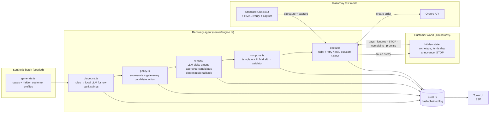

# Lamplighter — architecture

Lamplighter is an AI revenue-recovery agent for a Razorpay merchant. It takes a batch of at-risk revenue
(failed payments, abandoned checkouts, failed UPI AutoPay renewals, overdue B2B invoices), diagnoses each
case, chooses a bounded intervention, executes it against Razorpay test-mode APIs, and reports the money
it actually got back — with a tamper-evident audit trail and honest metrics against a naive baseline.

## One picture



## The loop, per case

1. **Arrive.** Cases arrive across the first two simulated days, nights included. Ticks are one simulated hour; a live run is a week, the batch report uses 14 days because B2B promise-to-pay dates land a week or more out.
2. **Diagnose.** `rulesDiagnosis` maps Razorpay error objects (`code`, `reason`, `step`, description) to a root cause with a confidence.
   When rules are unsure (generic `payment_failed` with a raw bank/NPCI string such as `U30: DEBIT HAS BEEN FAILED (INSUFFICIENT BALANCE)` or `43: STOLEN CARD`),
   the local LLM classifies it under a strict JSON schema. Its answer only replaces the rules when its confidence is high, and the disagreement is logged.
3. **Enumerate candidates.** `evaluateCandidates` builds every possible action — silent retry, payment link per channel, voice call, incentive, mandate re-auth, escalate, close —
   and runs the full rule list on each one. Every check (passed or failed) goes to the audit log, so the drawer can show *why* an action was not taken.
4. **Choose.** If more than one substantive action survives *and* the top two are close in expected value (within 1.6×), the LLM picks by index from the approved list and explains itself in one line; it is told which option the numbers recommend and must give a reason to deviate. When one option clearly dominates, the numbers win without a model call.
   Anything outside the list, or any malformed answer, falls back to the highest expected-value candidate. Expected value counts channel cost, incentive cost and a goodwill cost that grows with each extra knock.
5. **Compose.** Templates always work. The LLM drafts warmer copy (Hinglish in Roman script for Hinglish customers) and a validator enforces:
   merchant name, exact amount, the `{link}` placeholder, the opt-out line, no threatening or urgency words, no Devanagari, discount stated when offered. Rejected drafts fall back to the template and are logged with the reason.
6. **Execute.** Customer-facing actions create a Razorpay **Order** and point the message at `/pay/:run/:case`, a self-hosted Standard Checkout page.
   Silent retries create an Order too (the retry attempt). Escalations carry a packet: diagnosis, what was tried, amount, customer.
7. **Observe.** The simulator decides how the hidden customer reacts: pays after a delay, promises to pay (B2B), ignores, replies STOP, or complains.
   STOP flips `doNotContact`; the policy then allows only escalate/close. A promise-to-pay freezes all contact until the promised date passes.
8. **Follow up.** After the minimum gap, inside the contact window, the case is re-planned from step 3. Quiet hours (21:00–09:00 IST) defer any customer-facing action to 09:00.
9. **Stop.** Touch caps, no-repeat, goodwill-aware EV, hard-decline and dispute rules end the loop by closing or escalating. Cases still open when the week ends are closed as "window ended" — never counted as recovered.

## Where the AI is, and where it is not

| decision | who decides | guard |
|---|---|---|
| root cause when Razorpay's structured error is unambiguous | rules | — |
| root cause from a raw bank string | local LLM | enum schema, confidence threshold, disagreement logged, accuracy measured against ground truth |
| what is *allowed* | policy engine (pure functions, unit-tested) | the LLM never sees a disallowed action |
| which allowed action to take | local LLM when options are close in EV (else EV fallback) | index must be in the approved list; the EV-recommended option is shown and deviating needs a reason |
| message wording | local LLM (else template) | validator with compliance rules |
| whether money moved | Razorpay (signature + capture) or the simulator | never the LLM |

The model runs locally (LM Studio, `qwen3-4b`, JSON-schema structured output). No API cost, no data leaves the machine, and the whole agent keeps working with the model off — that mode is part of the test matrix, not an afterthought.

## Failure handling that is exercised, not promised

- **LLM down / slow / garbage:** timeouts, schema validation, a 30 s cool-off when the server is unreachable, deterministic fallbacks at every stage. `chaos` injects failures on demand.
- **Razorpay 429 / 5xx:** calls are serialised and spaced ~700 ms apart; 429 backs off 2 s → 4 s → 8 s; three consecutive failures open a circuit for 15 s which the engine *waits out* rather than failing a whole simulated week. After three failed attempts on one case the message still goes out and the pay page creates the Order lazily; the case is flagged `api_degraded` for an operator.
- **Test-mode quotas:** Razorpay caps Payment Links at 30 per test account. Lamplighter hit it, so every link is an Order plus a self-hosted checkout page instead — no cap, and it demonstrates the Standard Checkout signature flow properly.
- **Customer says STOP mid-flight:** any scheduled silent retry is skipped, not executed.
- **Audit integrity:** every event carries `prevHash`/`hash`; `GET /api/runs/:id/verify` recomputes the chain.

## Repo map

```
server/
  engine.ts      the run loop, scheduling, outcomes, metrics, live-demo hooks
  policy.ts      rules, candidate enumeration, expected value, baseline
  diagnose.ts    rules + LLM root-cause classification
  compose.ts     templates, LLM drafting, validator
  simulator.ts   hidden customer world
  data/generate.ts  synthetic batch (Saanjh & Co.)
  razorpay.ts    throttled test-mode client, orders, capture, signature
  llm.ts         OpenAI-compatible local model client with json_schema
  audit.ts       hash-chained append-only log
  report.ts      markdown report
  batch.ts       headless runner (CLI)
  index.ts       Express API, SSE stream, pay page, verify endpoint
web/             the town (Vite + React + SVG)
tests/           vitest: policy rules, audit chain, generator, Razorpay client
docs/            API contract, UI brief, metrics, pitch
```
